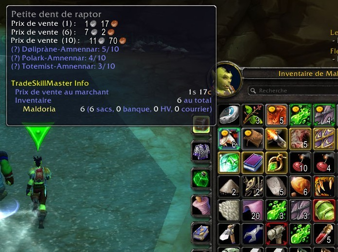
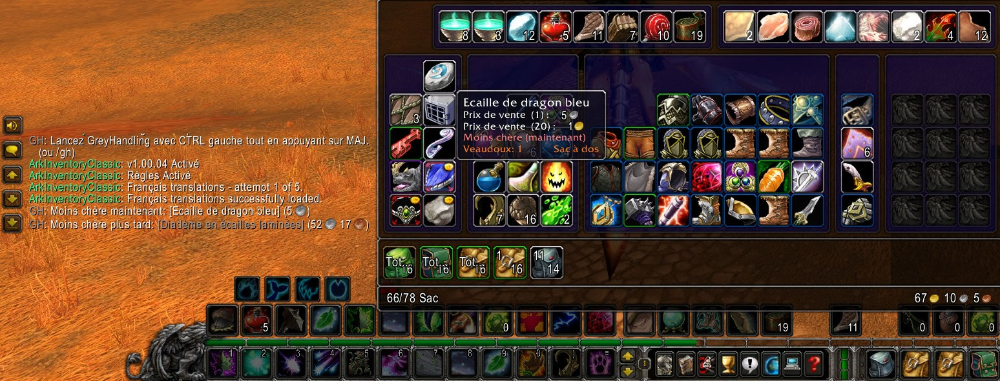
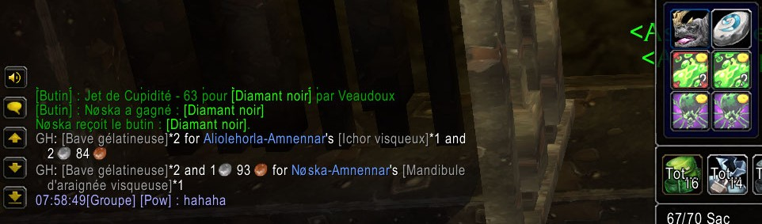
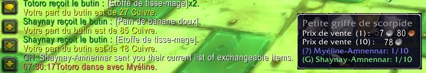

grey-handling
=============

|Install|

.. |Install| image:: http://img.shields.io/badge/install-twitch-blueviolet
   :target: https://www.curseforge.com/wow/addons/greyhandling

This addon aims to **make decisions about your objects easier when you have to
throw them or give them away**. It helps you know what are your cheapest objects
faster and what trade your teammates would likely accept. If you're in a group of person
that also have GreyHandling and Scrap, it will **permit to stack your item optimally by sharing
information with your teammates automatically**. Something can be junk for you and not for
someone else.

What does it do?
----------------

- Displays the **price (TSM's market value or vendor price), maximum stack of items, and number possessed by teammates in tooltip**

When you launch by hitting **left CTRL while holding SHIFT** :

- Search in what you consider as junk (by default grey item)
- If there is a worst item **pick it** (left click to throw or give)
- If there isn't a worst item **mark your two worst items in bag in red**

The two worst items are the cheapest at the moment and the cheapest once fully
stacked.

- If you saw what your teammate looted items and one ore more **mutually beneficial trades** exist, suggest the one that stack the most value.

A mutually beneficial trade is an exchange that permits to free one bag
space for everyone without throwing anything by keeping one kind of stackable
grey instead of two. What is junk for someone might not be junk for someone else.

- If someone also has GreyHandling in your group : **exchange exact information about your junk items** in order to offer better exchange suggestion.

Compatibility with other addons
-------------------------------

- **Scrap** If Scrap is installed, we can use your junk list (or not) as of July 2020 (*)
- **Peddler** If Peddler is installed, we can use your marked for sell list (or not) as of July 2020 (*)
- **OneBag3** This addon did not need any integration (<3 OneBag3 dev, you're the best)
- **ArkInventory** Working as of july 2020
- **Bagnon/Conductor** Both working as of July 2020
- **VendorPrice** You can disable GreyHandling item tooltip about prices, to not have twice the information.
- **Trade Skill Master** If you have TSM installed, we use max of the market value -5% (Auction house cut) and the vendor price

In bag mark do not work with bag addons that do not use the blizzard default bag interface. If
the bag mark does not work, **there is an optional text explanation**.

(*) If you change the Scrap or Peddler list of junk, you have to launch GreyHandling calculation to update bag marks.