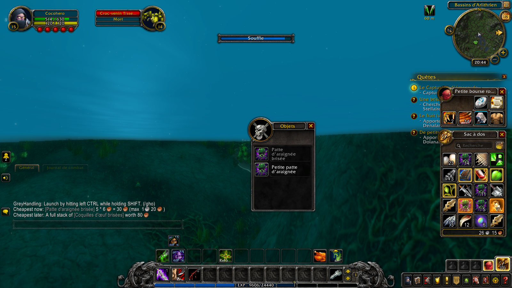

grey-handling
=============

This addon aims to **make decisions about your objects easier when you have to
throw them away**.

Let's say you have full bags and you're in the middle of a dungeon, far from a
vendor, or maybe underwater and about to drown or be ninja looted if you don't
loot this corpse pretty fast! Or maybe, you're playing with some
teammates that have free bag spaces, and you want to give them the worst,
the least useful, the least valuable and the least expensive item of your
inventory in order to be known server-wide as a generous individual.

Well, this addon is for you !

What does it do?
----------------

- Displays in tooltip the price of items in your bags (especially useful for WOW Classic).
- Instantly pick the worst item so you can throw it away or trade it to another player.
- If the choice isn't clear, display your two worst items (the cheapest at the moment and the cheapest once fully stacked) so you can choose for yourself

For example, if you have:
  * 4 leather skins worth 20 coppers
  * 1 cloth robe worth 25 coppers
  * 1 cape (muddy, and only for demonists), worth 8 coppers

The skins are worth 20, the cloth robe is worth 25, so everything is worth
more than the muddy cape. If you activate the addon, it pick the cape up and
**you just have to left click to get rid of the cape**.

Then if you throw away the cape :

The 4 leather skins are cheaper than the robe, but stacked leather skins
are more valuable than the cloth robe that can't be stacked. **Both items
will glow in orange inside your bags**, giving you the final choice.

Compatibility with other bags addons
------------------------------------

-  Everything works the same with **OneBag3**.
- The orange glow in **ArkInventory** is replaced with a bright yellow glow that is not removed by mouseover (Launch the addon again to update).
- The orange glow does not currently work work with **Inventorian**.

If the orange glow does not work with your addons, you can always activate the text
explanation in options and then look for the item yourself (visually or with its
name if the addon you are using has a search bar).

