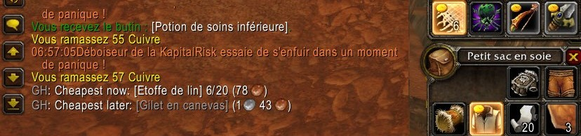
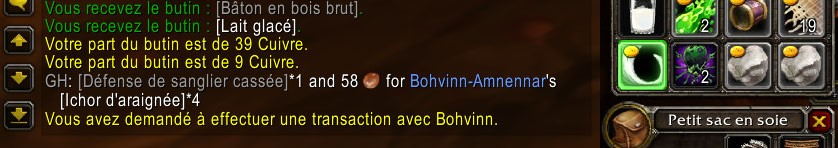
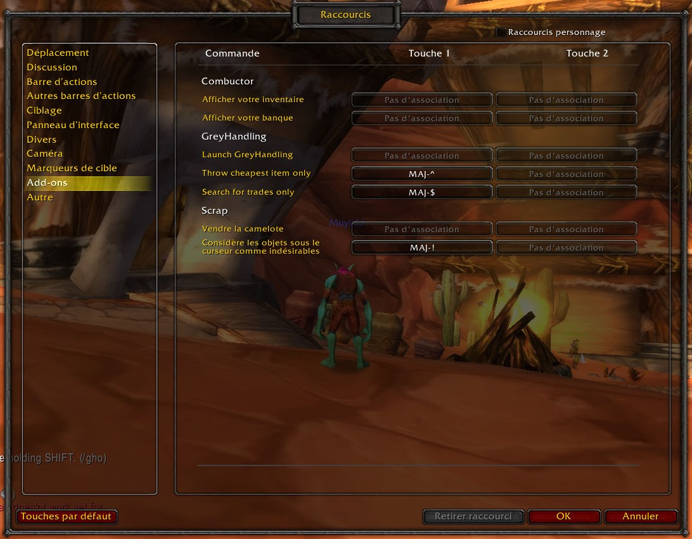
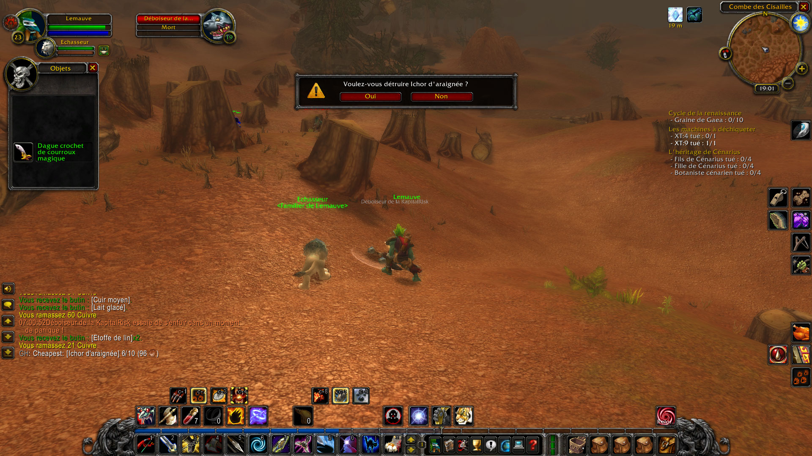
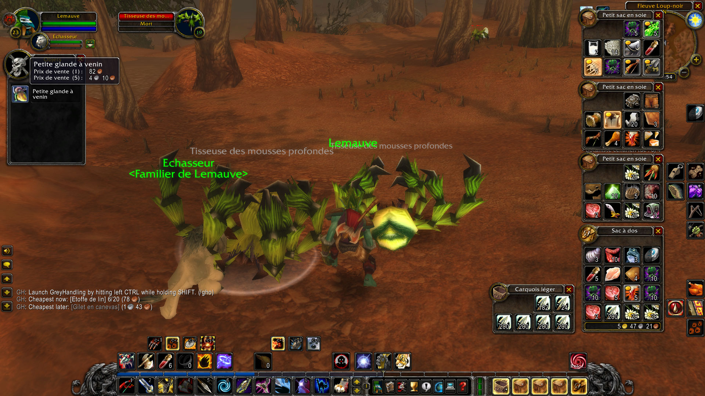
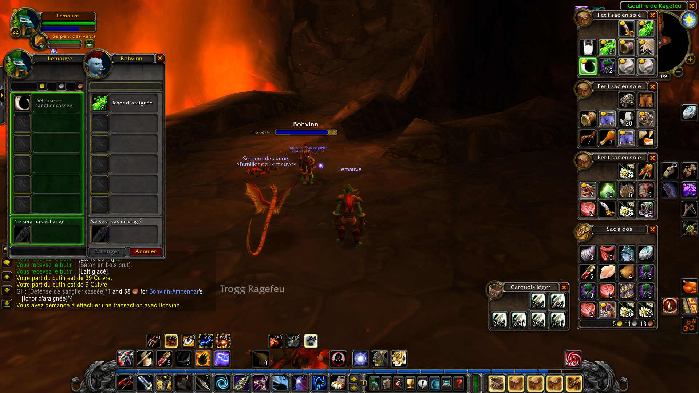

grey-handling
=============

|Install|

.. |Install| image:: http://img.shields.io/badge/install-twitch-blueviolet
   :target: https://www.curseforge.com/wow/addons/greyhandling

This addon aims to **make decisions about your objects easier when you have to
throw them or give them away**. It helps you know what are your cheapest objects
faster and what trade your teammates would likely accept. If you're in a group of person
that also have GreyHandling and Scrap, it will **permit to stack your item optimally by sharing
information with your teammates automatically**. Something can be junk for you and not for
someone else.

.. image:: examples/item_tooltip_group.jpg
   :width: 300pt

What does it do?
----------------

- Displays the **price, maximum stack of items, and number possessed by teammates in tooltip**

When you launch by hitting **left CTRL while holding SHIFT** :

- Search in what you consider as junk (by default grey item)
- If your bags are full **pick the worst item** (left click to throw or give)
- If there isn't a worst item **mark your two worst items in bag in red**
- If you saw what your teammate looted items and one ore more **mutually beneficial trades** exist, suggest the one that stack the most value.
- If someone also has GreyHandling in your group : **exchange exact information about your junk items** in order to offer better exchange suggestion.

If you have a bag addon like **ArkInventory** or **Bagnon**:

- Mark the cheapest item(s) in red, and the exchangeable items in green all the time.

The two worst items are the cheapest at the moment and the cheapest once fully
stacked. A mutually beneficial trade is an exchange that permits to free one bag
space for everyone without throwing anything by keeping one kind of stackable
grey instead of two. What is junk for someone might not be junk for someone else.

Compatibility with other bags addons
------------------------------------

- **Scrap** If scrap is installed, we can use your junk list (or not)
- **OneBag3** This addon did not need any integration (<3 OneBag3 dev, you're the best)
- **ArkInventory** Working as of october 2019
- **Bagnon/Conductor** Working as of october 2019
- **VendorPrice** You can disable GreyHandling item tooltip about prices, to not have twice the information.

In bag mark does not work with :

- **Inventorian**
- All other bag addons that do not use the blizzard default bag interface

If the bag mark does not work, **there is an optional text explanation**.

Changing the key binding
------------------------

You can disable the default key binding in option (it's more complicated than a keybind, because you need to press
CTRL while holding shift). You can then define a new one in Keybinding/Addons. This menu is accessible when you
type "escape" in game.

What does it do in detail?
--------------------------

For example, if you have:

* 4 leather skins worth 4*5 coppers = 20 coppers
* 1 cloth robe worth 25 coppers
* 1 cape (muddy, and only for demonists), worth 8 coppers
* 5 rocks worth 5*10 coppers = 50 coppers
* 1 tough jerky worth 1 copper

The muddy cape can't stack and is your cheapest grey item. If you activate the
addon, it pick the cape up and **you just have to left click to get rid of the cape**
(or right click to cancel the pick up).

Then if you throw away the cape, the 4 leather skins are cheaper than the robe,
but the addon know you can stack 20 of them together, so 20 stacked leather
skins are worth 100c and are more valuable than the cloth robe that can't be stacked.
**Both items will be marked in red inside your bags**, giving you the final choice.
Because you're the only one who knows how close or not you are from a vendor or
if you're going to be killing 50 more boars with leather skins.

If you have scrap installed and the low level consumable is in your list of junk
then the cheapest item is the tough jerky.

Now, before throwing that, if you saw your teammate Alice loot:

* 3 rocks worth 3*10 coppers = 30 coppers
* 16 leather skins worth 16*5 coppers = 80 coppers

**All mutually beneficial trades will be marked in green (can be one for each teammates)**.
You can give 4 leather skins worth 20 copper for 3 rocks worth 30 coppers.
You do not throw anything and you can compensate Alice for her 3 rocks.
The addon will suggest 10 coppers, but you could give more because you would
have to throw at least 20 coppers if Alice refuses your offer. The addon does
not suggest that Alice give you her skin the trade would not be very fair for
her but you could compensate more.

And if Alice also has GreyHandling, then she will share information with you when activating
the addon and vice versa:

So your GreyHandling could knows that Alice had 19 tough jerky before you grouped, or that for Alice,
heavy leather is junk that she sell to NPC but for you it's a valuable crafting material. So it will
suggest more and better exchanges.

